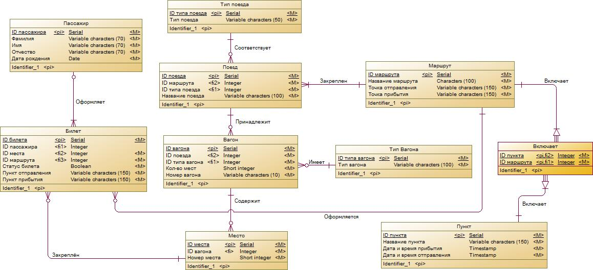
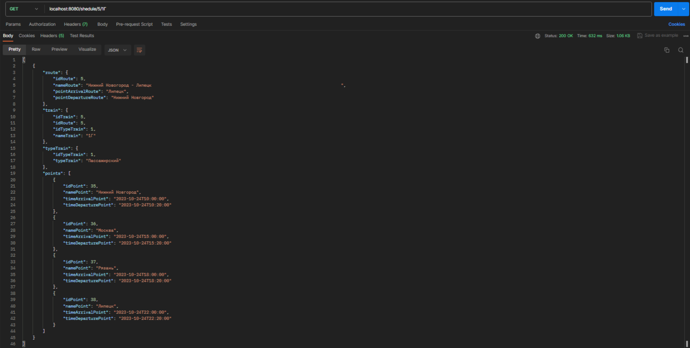
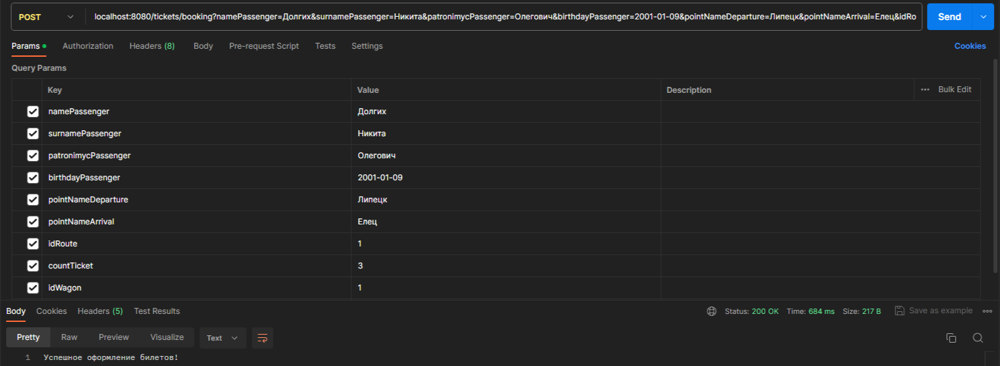
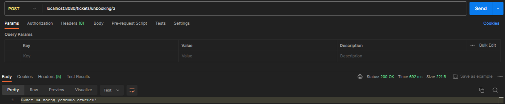
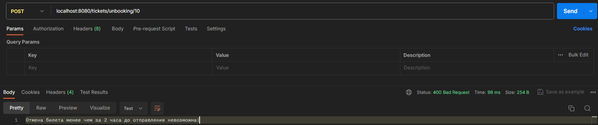

# Оформление билетов на поезд (микросервисное API)

___

## База данных

База данных содержит в себе 10 таблиц:
- Пассажиры;
- Билеты;
- Места;
- Вагоны;
- Типы вагонов;
- Поезда;
- Типы поездов;
- Маршруты;
- Промежуточная таблица, необходимая для свзяи многие-ко-многим (Маршруты - Пункты);
- Пункты.

___

## Получение информации о доступном расписании поездов по маршрутам

URL получения информации о доступном расписании поездов по маршруту:

> localhost:8080/shedule/{id_маршрута}/{название_поезда}

___

## Оформление групповых билетов на поезд (с проверкой доступности в соответствии с кол-вом)

URL оформления билетов на поезд:

> localhost:8080/tickets/booking

Данные, передаваемые через этот запрос:
- Имя пассажира (String);
- Фамилия пассажира (String);
- Отчество пассажира (String);
- Дата рождения пассажира (Date);
- ID выбранного маршрута (Long);
- Кол-во бронируемых мест (Integer);
- ID выбранного вагона (Long).

Групповое бронирование биллетов:

Попытка забронировать те же билеты:

___

## Отмена билета (не позднее, чем за 2 часа до отправления поезда)

URL отмены билета:

> localhost:8080/tickets/unbooking/{id_билета}

Отмена билета:

Попытка отмены билета менее, чем за 2 часа до отправления:

___